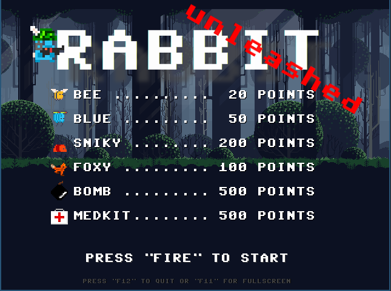
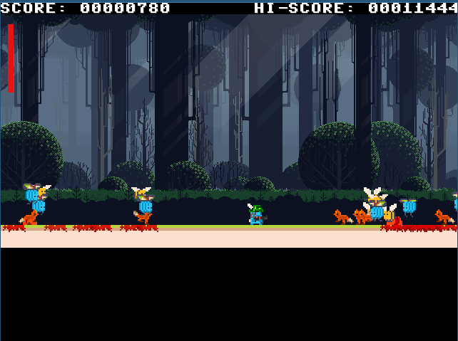
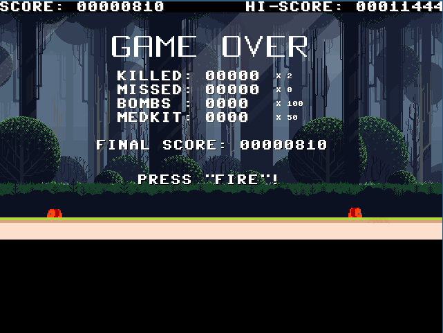

# Mini game engine suite (MGES)

Mini game engine suite is an attempt to re-create the same minigame in different platforms and languages. Currently, the game is implemented in .NET, TypeScript and Dart, but Java, Go, Rust, Scala, Pascal, F#, NodeJS is coming also.

The project is started to be an experiment to check .NET SDL2 bindings capabilities, and it turned out very successfully. So, I continued to port the game to other environments.

After I ported the core engine to TypeScript, the first surprising thing was how easy it was to port the game from .NET to TypeScript. I could copy/paste major part of the code and I only had to do minor modifications to make it work.

Porting from TypeScript to Dart was also straightforward.

## How to play

The game uses arrow keys for navigation and 'z' key for fire. The game itself is a basic shoot em up;
To start the game in the browser, you have to make an interaction (make a click) in the browser itself. This is a requirement by the browsers.

Title screen



Game play



Final score



## How to build

The project used GNU make files to build targets. 

## .NET version

The .NET uses core version 6.0 and contains SDL-CS2 binding project, and that is because I had to make small modifications.

To build the .NET version

```shell
make
```

To run the .NET version
```shell
make run
```

To make the final package

```shell
make publish
```

This will create Linux and Windows versions.

## TypeScript version

The TypeScript version uses `bun` to compile and run the code.

To build TS version
```shell
make
```

To run TS version
```shell
make serve
```

After this you can visit `http://127.0.0.1:8000` to run the game in your browser

## Dart version

For Dart version is it recommended to install webdev

### To install webdev

```
dart pub global activate webdev
```

To run Dart version
```shell
make run
```

After this a new chrome window should be opened. 

To make the final package
```shell
make build
```

Then the final packaged version can be found in `public` folder.

---

Libraries/tools/assets:

- https://www.libsdl.org/
- https://github.com/flibitijibibo/SDL2-CS
- https://www.kenney.nl/assets/pixel-line-platformer
- https://bun.sh/
- https://dart.dev/

